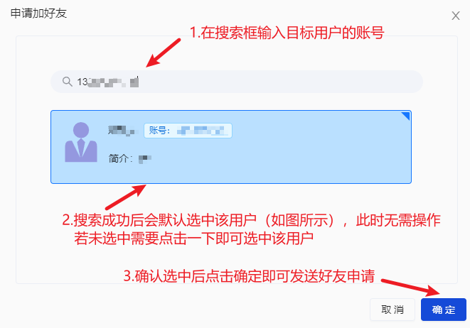
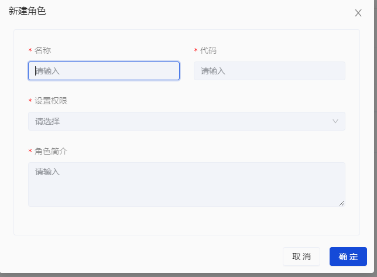
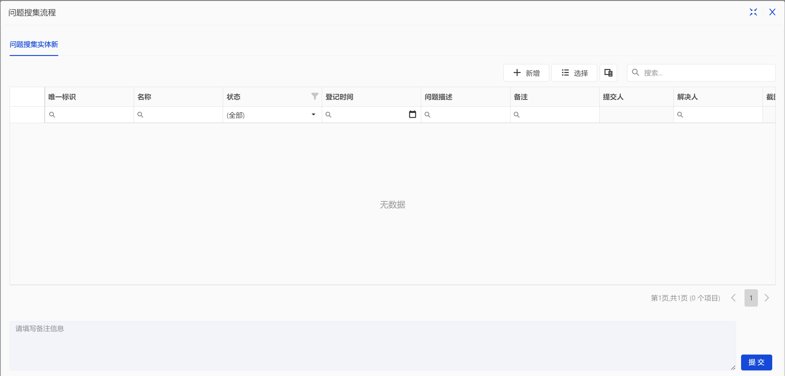

# **用户操作手册**

## **1.引言**

### **1.1编写目的**

 本操作手册供奥集能平台操作人员参考使用，向**PC端**使用人员说明本系统的具体操作方法。

### **1.2项目背景**

 Orginone利用云原生技术，专注用户价值，秉持“精一”理念，集成各种能力，面向组织用户提供统一应用界面。

### **1.3术语定义**

### **1.4参考资料**

+ 奥集能研发项目的计划任务书、合同或批文。
+ 奥集能研发项目的开发计划。
+ 奥集能需求规格说明书。
+ 奥集能设计说明书。

## **2.运行环境**

建议使用Chrome或Firefox浏览器操作奥集能平台

## **3.操作说明**

### 3.1登录注册

首次进入奥集能平台需要注册账号，进入平台登录页面后点击左下角的**注册用户**即可进入注册界面

进入注册页面后根据提示输入完整相关信息，注册成功后会跳出账户私钥窗口，请妥善保存该私钥，在后续重置密码解密数据过程中须使用该私钥。

在记录完毕账户私钥后，点击“**已记住？去登录**“即可跳转回登录页面，输入刚才注册用的账号与密码即可登录进入平台首页。

### **3.2 好友操作**

#### **3.2.1添加好友**

添加好友步骤如下图所示

若需查看已发送过的添加申请，首先点击首页的**办事按钮**进入办事页面

接着在侧边栏点击自己的名字，侧边栏会出现“**待办事项**”、“**已办事项**”、“**我发起的**”三个按钮

然后点击“**我发起的**”即可查看自己发送过的好友申请

#### **3.2.2删除好友**

首先点击首页右上角的“**设置**”进入设置模块

接着在侧边栏点击自己的名字，再点击“**我的好友**”即可打开已添加好友页面。

删除操作见下图所示

#### **3.2.3分配好友**

如果需要将某个好友快捷分配到某个单位/部门/群组/组织，可以使用“分配成员”功能。
首先进入我的好友页面

接下来的操作如图所示

### **3.3单位管理**

#### **3.3.1添加单位**

该步骤类似添加好友，在主页点击“**加单位**”后输入单位社会统一信用代码进行搜索即可

#### **3.3.2建立单位**

建立单位步骤如图所示

进入**设置模块**在侧边栏点击**单位**即可查看相关信息

#### **3.3.3成员管理（需要管理员权限）**

首先**进入单位详细页**后点击**成员目录**

添加单位成员

删除单位成员

#### **3.3.4权限设置**

首先**进入单位详细页**后点击**成员目录**

点击**权限设置**后会打开权限窗口，如下图所示，其中红框内的三种权限是新建单位后自动生成的

若要新建权限，首先点击右上角的“**+**”号

在二级窗口中输入相关信息后点击**确定**即可新建权限

#### **3.3.5角色设置**

首先进入单位详细页后点击**成员目录**

点击**角色设置**后会打开角色窗口，如下图所示，其中“管理员”角色为平台自动生成的超级管理员，其中分配的成员具有单位所有管理权限，点击右上角的“**+**”即可添加新角色

打开如下图所示的“**新建角色**”窗口输入相关信息后点击**确定**即可新建角色。此步骤中设置的权限是选择上一步权限设置中已经设置好的权限，若直接选择“超级管理权”则该角色可以拥有对单位的所有管理权限。请注意，为角色设置权限之后不能更改该角色拥有的权限。

新建完毕角色后，点击左侧菜单栏的**该角色**即可查看相关信息以及目前担任该角色的成员列表。点击右上角的“**分配成员**”可以为任命成员担任该角色。若想删除该角色或者更改该角色信息点击**右上角三个点图标**即可。

#### **3.3.6岗位设置**

首先进入单位详细页后点击**成员目录**

点击**岗位设置**后会打开岗位窗口，如下图所示，平台并不会设置单位的默认岗位，点击右上角的“+”即可新增岗位。

打开如下图所示的“**新建岗位**”窗口输入相关信息后点击确定即可新建岗位。

新建完毕岗位后，点击菜单栏右侧的**该岗位**，会出现上下两个列表，上方列表为该岗位具备的角色权限，下方列表对应的是目前担任该岗位的成员。分配岗位角色权限的操作需要点击右上角的“**钥匙**”图标。点击右上角的“**分配成员**”可以为任命成员担任该岗位。若想删除该岗位或者更改该岗位信息点击**右上角三个点图标**即可。

#### **3.3.7集群/部门设置**

首先进入单位详细页，之后的操作见下图

新建后的集群/部门拥有和单位基本一样的操作。但是在集群/部门下只能再新建集群/部门，不能在部门之下新建集群，并且成员管理中只存在角色管理，权限和岗位继承自父单位。若想删除或者编辑集群/部门，只需要在单位详细页右键想要操作的集群/部门即可

#### **3.3.8自定义模块**

首先进入单位详细页，之后的操作见下图

### **3.4沟通操作**

点击右上角的**聊天图标**，进入沟通页面

#### **3.4.1群聊**

用户可以在侧边栏中选择群聊，或者在列表中选择群聊，另外单位也可以作为群聊，属于全员群

在单位和个人下存在着超级管理权群，单位下有着超级管理权的人员都会加入到该群。因为个人对自己有着最高的权限，个人页面下也会显示超级管理权群，且只有自己一人

点击**群聊图标**，进入聊天页面之后即可开始聊天

#### **3.4.2单聊**

同样在沟通页面下，点击**个人的头像**，则可显示好友以及个人，可以与好友或或者自己聊天

在加入的组织下，可以查看和您处于同一组织的人员，并选择与同一组织的人员聊天

#### **3.4.3文件传输和存储**

在聊天输入框的上方，点击**文件图标**即可选择文件上传

上传的文件会在聊天框中显示，可以**点击文件**，打开并预览文件

若是右击文件，还可以选择将文件下载到本地

所有聊天时所发送的文件都会保存在存储中，用户可以点击共享目录在存储查看

#### **3.4.4查询聊天记录**

同样在聊天的详情下，点击**查找聊天记录**，在弹窗的搜索框中可以模糊搜索聊天记录

### **3.5 存储操作**

#### **3.5.1文件上传**

点击右上角的存储图标，进入存储页面

可以在侧边栏中右击目录，点击**上传文件**，在弹窗中选择上传文件，可以选择**点击或拖拽**的方式上传文件

#### **3.5.2文件管理**

右击文件，可以对文件进行操作，如：下载，复制，剪切，彻底删除，重命名，查看详细信息，生成二维码等

### **3.6办事操作**

#### **3.6.1发起办事**

在存储页面中点击应用，可以在引用中查看办事
>办事只能存在于应用下,有关于应用开发的详细操作请参考[奥集能应用开发指南](../奥集能应用开发指南/readme.md)

点击**办事**，填写表单信息即可

#### **3.6.2审核办事**

在您发起了一则办事之后，会在“**我发起的**”下显示该办事，并且可以实时查看审批状态

若您是审批人，再他人发起了一则办事后，会在“待办事项”下显示需要审批的办事

点击办事之后，会打开办事的审批页面，显示办事的详细信息，可以点击通过或驳回

若您发起的办事审批结束，会在“已办事项”下显示已审批完毕的办事

