# **第一部分 Orginone**

## **第1章 认识Orginone**

### **1.1 什么是Orginone**

> Org-in-one 英文发音[ˈɔːdʒɪnʌn]，中文:奥集能

**Orginone**利用云原生技术，专注用户价值，秉持“精一”理念，集成各种能力，面向组织用户提供统一应用界面。

组织用户可以获取应用也可以上架应用。

上架应用应以组织为颗粒度设计多租户，用户从属于组织，组织有内设机构和岗位，用户可以加入多组织，组织之间可以组成集团。

传统SaaS应用提供服务，组织或用户需要登陆服务地址，注册账号，提供相关用户认证信息。Orginone要求面向组织和用户聚合服务。SaaS应用必须注册到平台，组织用户登陆平台，即可获取、分配和使用SaaS服务。

### **1.2 Orginone的理念**

#### **1.2.1 精一**

**精一**语出《尚书·大禹谟》：“人心惟危，道心惟微，惟精惟一，允执厥中” 。

#### **1.2.2 核心关键词**

**精益、专注、中立**

Orginone以组织用户为中心，利用云原生技术提升应用和数据的管理能力，让组织更专注核心业务的代码和数据，以All-in-one方式降低组织中用户对工作的心智负担。

保持平台开放和中立，通过更细颗粒度的划分服务边界，明晰权责利关系，激发市场创新活力。聚焦能力集成，快速迭代，精益求精，为组织用户业务数字化改革和价值创造提供持续的推动力。

### **1.3 Orginone的目标**

> 成为面向组织用户的云原生操作系统。

为组织提供一体化操作界面，集中管理组织架构和用户体系，满足组织用户统一管理软件、业务数据和云资源等核心数字资产的需求，面向用户聚合各类云服务。利用云原生技术架构原则和设计模式，发挥平台优势，解开组织、应用、数据和资源的耦合关系，以应用市场上架和获取云服务方式，转变传统软件交付和分发模式，聚焦组织用户的核心价值，培育云服务市场生态，改进组织间大规模协作机制，优化资源配置，推动数字化改革，提高社会整体运转效率。

### **1.4 专注能力集成**

Orginone 聚焦组织核心业务，围绕用户做聚合服务。

基于云原生技术架构原则和设计模式，充分利用以Kubernetes为核心的开源生态优势，通过OAM等开放标准，向下封装基础设施资源，屏蔽底层架构的差异性，向上支撑多种工作负载和分布式架构。提供应用全生命周期管理、运维管理、配置范围和扩展和管理、以及语言无关的编程框架，一起构成崭新的应用与云之间的操作界面。

将云应用中的非业务代码部分进行最大化的剥离，从而让云设施接管应用中原有的大量非功能特性（如弹性、韧性、安全、可观测性、灰度等），使业务不再有非功能性业务中断困扰的同时，具备轻量、敏捷、高度自动化的优势。满足大数据、人工智能、物联网、区块链等各种类型场景应用需求。

Orginone主要聚焦以下四个方面能力的集成：

#### **1.4.1 应用管理能力**

提供应用开发、部署、迭代、运维、运营能力。利用各类公共组件，敏捷开发环境，快速搭建应用。提供从代码到镜像到部署的流水线支持，通过持续集成和持续部署，进行快速迭代。提供的组件、接口、服务和应用的各种颗粒度运维和运营能力。利用市场机制，提供应用上架、发布、下架、工单等运营工具满足基本商业化运营需求。

#### **1.4.2 组织管理能力**

提供灵活的组织管理。根据业务场景自由创建组织树。能够实现组织树继承、复制、迁移、拆分、合并等操作，满足各类跨地区、跨层级、跨部门的针对组织树的应用分发、流程设计。能够对接各类基于组织树的用户验证和鉴权，消息分发，数据操作等复杂组织管理需求。

#### **1.4.2 数据管理能力**

提供数据分析、建模能力,专注业务层数据服务能力。利用消息机制，实现元数据、字典等数据标准的维护、发布等管理，在应用设计和建模阶段介入对数据的管理，实现数据规范的前对齐。拥有完善的数据治理能力，能够平滑对接各类开放域或私有域的基础数据平台，公共数据服务平台。实现对数据资产细颗粒度的保护，输出各类场景数据服务，支持应用迭代和创新需求。

#### **1.4.3 资源管理能力**

利用云原生技术，屏蔽基础资源的差异，实现平台和底层资源解藕，对接虚拟计算资源、容器平台、云存储资源、区块链、物联网等各类基础云服务平台，实现跨云资源适配和管理能力，统一向应用层输出基础能力。

### **1.5 领域驱动设计**

#### **1.5.1 平台即应用 应用即平台**

#### **1.5.2 平台即组织 组织即平台**

## **第2章 奥集能平台进化史**

### **2.1 资产云1.0**

### **2.2 资产云2.0**

### **2.3 奥集能平台**

### **2.4 本章小结**

# **第二部分 奥集能平台**


## **第3章 奥集能平台业务**

### **3.1 简介**

奥集能平台是面向下一代互联网发展趋势，基于动态演化的复杂系统多主体建模方法，以所有权作为第一优先级，运用零信任安全机制，按自组织分形理念提炼和抽象“沟通、办事、存储和设置”等基础功能，为b端和c端融合的全场景业务的提供新一代分布式应用架构。

体验地址：[https://orginone.cn](https://orginone.cn)

# **第三部分 奥集能平台设计**

## **第4章 奥集能代码设计**

### **4.1 奥集能后端内核架构**

#### **4.1.1 简介**

本小节是奥集能平台的后端内核实现。

#### **4.1.2 项目目录**

```
├─convert                     // 实体类
├─core                        // 内核主要代码
│  ├─chat                     // IM聊天
│  ├─public                   // 钱包
│  ├─target                   // 组织架构
│  ├─thing                    // 标准制定
│  └─work                     // 流程
├─etc                         // 配置文件
├─interceptors                // 捕获事务异常
├─internal
│  ├─config                   // 配置类
│  ├─handler                  // 路由组
│  ├─hub                      // 注册signalR
│  ├─logic                    // rpc
│  ├─server                   // rpc接口
│  ├─svc                      // rpc上下文
│  └─types                    // 返回类型
└─store                       // ent生成的文件
    ├─enttest
    ├─hook
    ├─migrate
    ├─predicate
    ├─runtime
    ├─tbapplication
    ├─tbattribute
    ├─tbattrlinkprop
    ├─tbauthority
    ├─tbdirectory
    ├─tbform
    ├─tbidentity
    ├─tbidproof
    ├─tbproperty
    ├─tbrelation
    ├─tbspecies
    ├─tbspeciesitem
    ├─tbtarget
    ├─tbteam
    ├─tbteamidentity
    ├─tbthing
    ├─tbthingprop
    ├─tbworkdefine
    ├─tbworkinstance
    ├─tbworknode
    ├─tbworknoderelation
    ├─tbworkrecord
    └─tbworktask

```

#### **4.1.3 整体结构图**

##### **4.1.3.1 第一层 - System Context**

在这一层提供的是系统级别的总览关系图

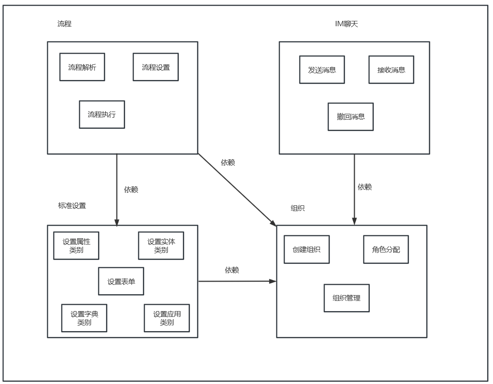

组织对应平台的组织架构，组织的类型分为人员、单位、岗位、部门、集团。IM聊天依赖组织，聊天分为个人消息和单位消息。标准设置主要分为设置属性、设置实体、设置表单、设置字典、设置应用。标准设置依赖组织，设置的标准归属是组织。流程依赖于组织，在流程设置时，需要关联组织中的职权作为审批对象，在流程执行的过程中需要对应职权的人员进行审批。流程依赖标准设置中的表单，流程设置需要关联表单，流程执行需要表单数据。

##### **4.1.3.2 第二层 - Container**

这一层是上一层Context的继续，是将各个System Context放大的效果。

###### **4.1.3.2.1 IM聊天**

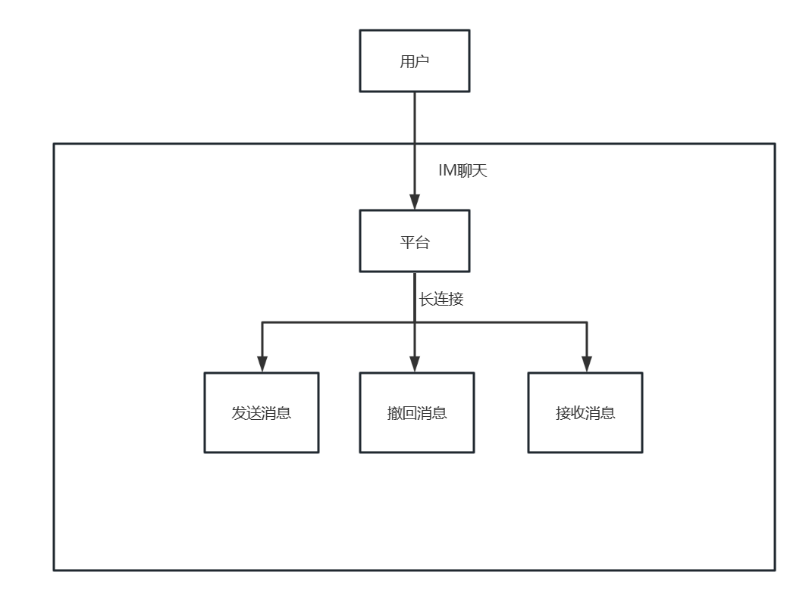

IM聊天对应平台沟通的功能，具体功能有发送消息（个人消息、单位消息）、接收消息、撤回消息。IM聊天依赖组织，聊天分为个人消息和单位消息。

###### **4.1.3.2.2 流程**

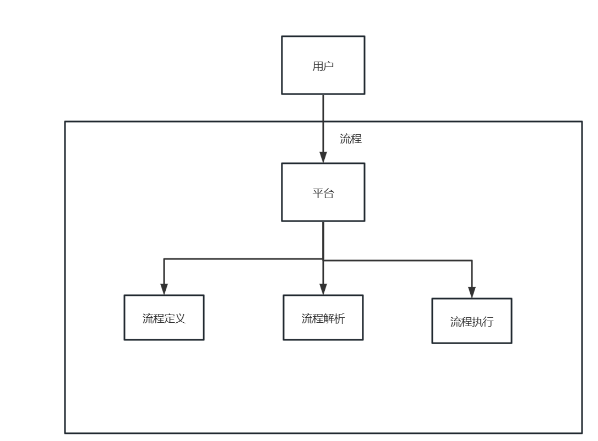

流程对应平台待办、流程设置。新建流程时可对流程进行设置，流程解析是将设置的流程按照一定的规则进行解析，形成按一定顺序的审批过程。流程执行对应平台的待办。流程依赖于组织，在流程设置时，需要关联组织中的职权作为审批对象，在流程执行的过程中需要，对应职权的人员进行审批。流程依赖标准设置中的表单，流程设置需要关联表单，流程执行需要表单数据。

###### **4.1.3.2.3 组织**

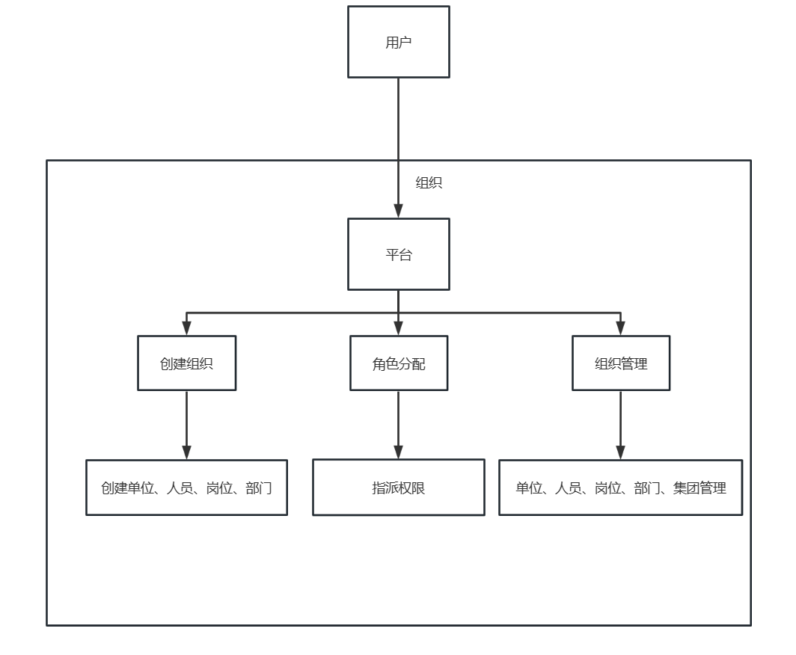

组织对应平台的组织架构，组织的类型分为人员、单位、岗位、部门、集团。角色分配是赋予人员相应的身份权限，组织权限有超级管理权（所有权权限）、关系管理权（用户关系管理权限）、事务管理权（用于财务管理权限）、配置管理权（用于办事管理权限）。组织管理是对组织内人员、角色、岗位、部门、集团等进行管理。

###### **4.1.3.2.4 标准设置**

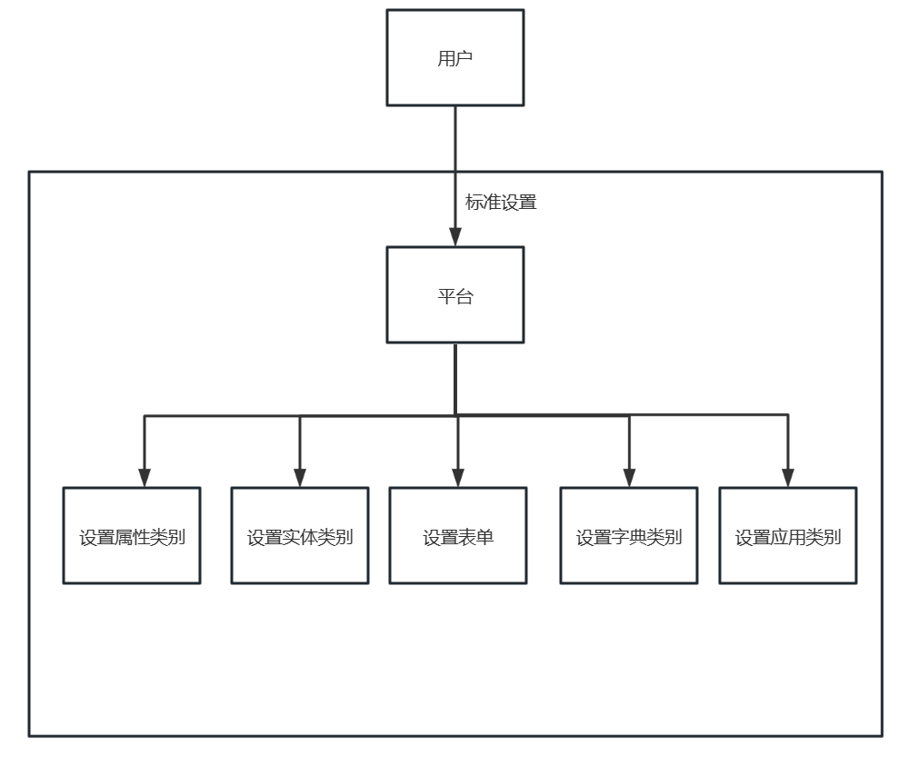

标准设置主要分为设置属性、设置实体、设置表单、设置字典、设置应用。标准设置依赖组织，设置的标准归属是组织。

#### **4.1.4 技术栈**

开发语言：GoLang

依赖框架：Ent、GoZero

数据库：MySQL8、Redis...

工具：GoLand、VsCode、LiteIDE...

其他：Docker、Kubernetes、Kubesphere、Jenkins、Shell、Protoc、Ectd...

### **4.2 奥集能前端架构**

#### **4.2.1 奥集能平台---react分支**

##### **4.2.1.1 简介**

本小节是奥集能平台前端的 react 实现。

##### **4.2.1.2 项目目录**

```
├─.husky                               // husky git hooks配置目录
 ├── commit-msg                        // commit-msg钩子，用于验证 message格式
 ├── pre-commit                        // pre-commit钩子，主要是和eslint配合
├─config                               // 全局配置文件
 ├─theme                               // 主题配置
 ├─vite                                // vite 相关配置 代理配置
 ├── constant.ts                       // 项目配置
├─public                               // 静态资源目录（聊天表情、icon、图片、视频）
├─src
 ├─assets                              // 静态资源文件夹（主要放公用css）
 ├─bizcomponents                       // 业务组件
 ├── components                        // 全局组件
 ├─executor                            // 设置模块引用组件
 ├── hooks                             // 自定义 hooks
 ├── layouts                           // 全局布局
 ├── routes                            // 路由
 ├── pages                             // 页面目录
   ├─Chats                             // 沟通模块
   ├─Home                              // 首页
   ├─Online                            // todo
   ├─Passport                          // 登录注册模块
   ├─Setting                           // 设置模块
   ├─Store                             // 存储模块
   ├─Work                              // 办事模块
 ├─ts 
   ├─base
   ├─api
        ├─kernelapi.ts                 // 系统内核api
        ├─anystore.ts                  // 任意数据存储类
        ├─storehub.ts                  // 存储层hub
     ├─schema.ts                       // 专有定义
     ├─model.ts                        // 类型定义
   ├─controller                        // 控制器
   ├─core                              // 各模块方法
     ├─chat                            // 会话模块
     ├─public                          // 公有方法
     ├─target                          // 用户相关（见Setting模块）
     ├─thing                           // 各专有类型（如应用类、目录类）
     ├─work                            // 办事模块
 ├── utils                             // 全局通用工具库
 ├── app.tsx                           // 顶层文件
 ├── index.tsx                         // 项目入口文件
 ├── typings                           // 项目type类型定义文件夹
├── .editorconfig                      // IDE格式规范
├── .eslintignore                      // eslint忽略
├── .eslintrc                          // eslint配置文件
├── .gitignore                         // git忽略
├── .hintrc                            // 代码检验配置
├── .npmrc                             // npm配置文件
├── .prettierignore                    // prettierc忽略
├── .prettierrc                        // prettierc配置文件
├── commitlint.config                  // git提交配置文件
├── index.html                         // 入口文件
├── LICENSE.md                         // LICENSE
├── package.json                       // package
├── postcss.config.js                  // postcss
├── README.md                          // README
├── tsconfig.json                      // typescript配置文件
└── vite.config.ts                     // vite
```

##### **4.2.1.3 功能结构图**

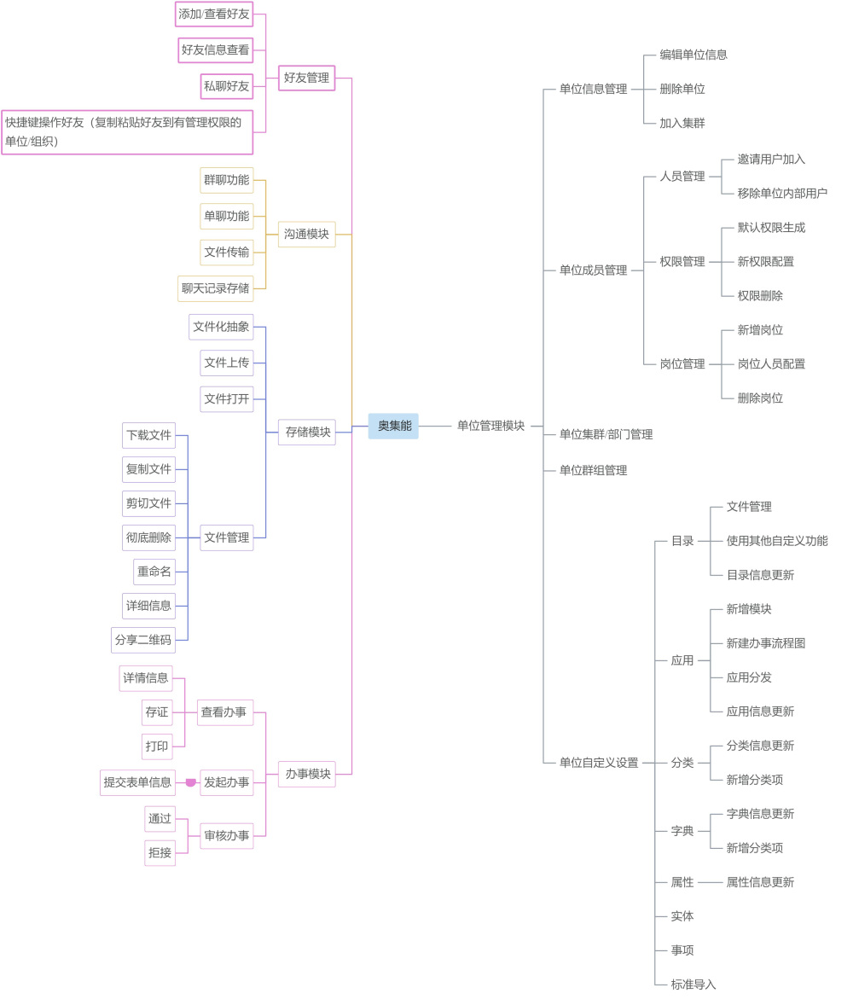

##### **4.2.1.4 技术栈**

本项目开发使用的主要技术栈为 **React **全家桶、**Type Script**、**Less**、**SignalR**，用来完成项目的框架、样式以及逻辑交互，配合使用 **EsLint**语法检查规则，**Ant Design**、**Ant
Design Pro** 、**devextreme UI** 组件库，**localStorage**缓存技术，以及其它的一些前端第三方包。

##### **4.2.1.5 项目依赖环境、安装和运行**

奥集能平台是基于 **node 14+** 以上的环境运行，通过 **yarn** 或者 **npm install** 下载安装项目依赖包，并通过**npm run serve** 命令本地运行项目。

##### **4.2.1.6 参与贡献**

1. fork 项目
   1. 首先，找到 fork 按钮，点击以后，你的存储内就会出现一个一模一样的项目。
2. 项目开发
   1. 按照奥集能平台项目的编码规则，对代码进行开发。
3. 跟上主项目的步伐
   1. 在你开发的过程中，主项目的代码也可能在更新。此时就需要你同步主项目的代码，找到 **Pull request** 按钮，点击。
   2. 在左侧选择你的存储的项目，右侧为主项目，此时你能在下面看到两个项目的区别，**点击 create pull request 按钮。**
   3. 填写 title，**点击 create pull request 按钮。**
   4. 进入 pull request 页面，拉到最下面，**点击 Merge pull request 按钮并确认，**现在你和主项目的代码就是同步的了。
4. Pull request
   1. 当你觉得你的代码开发完成，可以推送时，在确保你的修改全部推送到了你的存储的项目中，然后进入你的存储的项目页面，**点击 New pull request 按钮**，
   2. 然后**点击 create pull request 按钮**进行代码提交。
5. 审核
   1. 待项目的开发者审批完成之后，就是贡献成功了。

## **第5章 奥集能应用架构**

### **5.1 通用领域模块**

#### **5.1.1 好友管理模块**

该模块支持用户进行好友的添加与删除，好友详细信息查看、私聊好友以及快捷操作好友。

##### **5.1.1.1 添加好友**

用户进入平台首页后，点击常用栏下的“加好友”即可打开添加好友弹窗，输入目标用户账号进行搜索后就可以添加好友。发出申请后，可以在“办事——我的——我发起的”中查看该申请的详情信息，被添加用户则可以在“办事——我的——待办事项”中点击“操作——详情”进行申请的同意与拒绝。

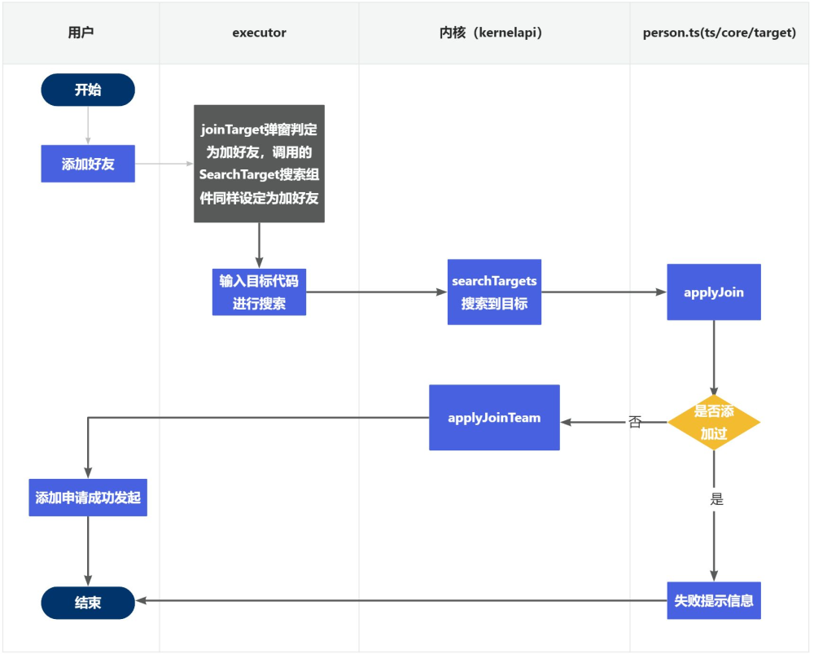

另一种添加好友的方式是进入设置模块后，点击“我的——我的好友”，右键我的好友，选择邀请成员输入目标用户账号进行搜索后就可以添加好友。

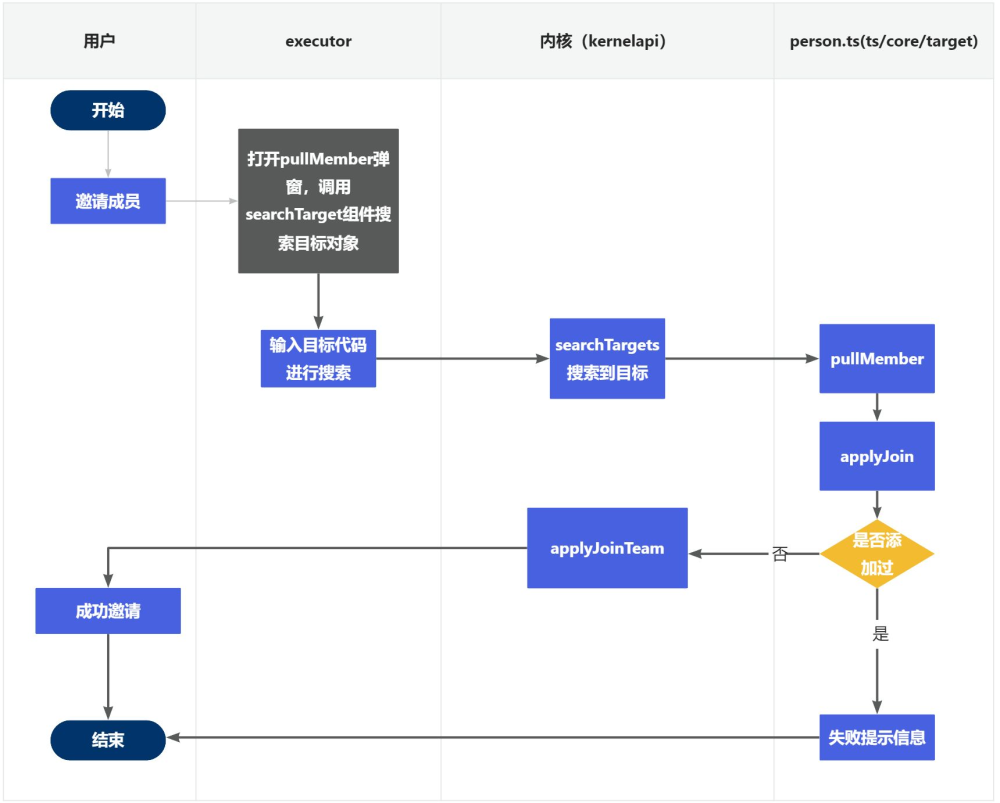

##### **5.1.1.2 删除好友**

用户进入设置模块后，点击“我的——我的好友”，右键需要操作的对象，点击移除成员即可成功删除好友。

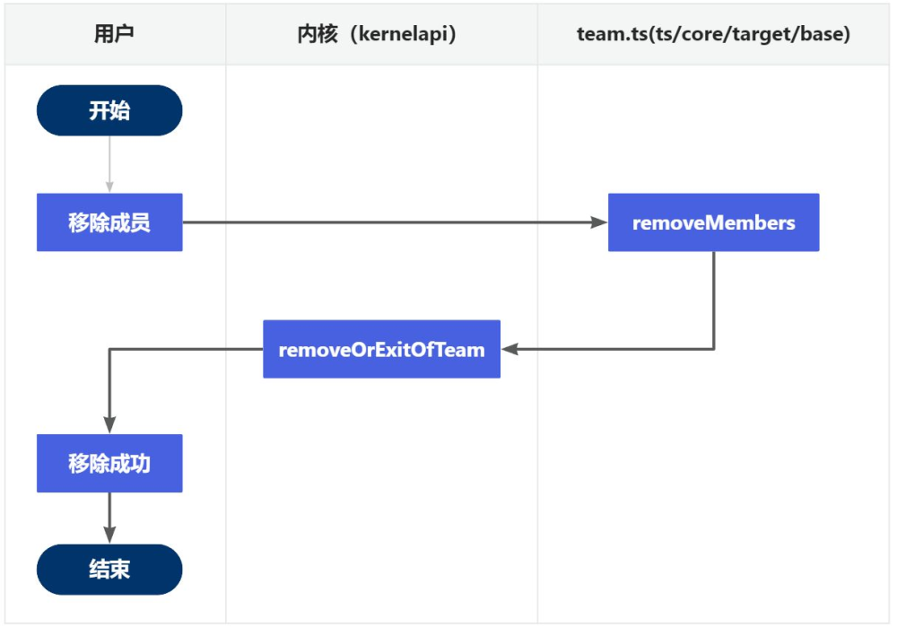

##### **5.1.1.3 好友私聊**

用户进入设置模块后，点击“我的——我的好友”，右键需要操作的对象，点击打开会话即可跳转到对应的沟通界面。

该功能通过command.ts中的emitter发送一个link指令打开会话。

##### **5.1.1.4 快捷操作**

用户进入设置模块后，点击“我的——我的好友”，右键需要操作的对象，点击分配成员即可将目标对象存入剪贴板中，之后进入需要操作的组织或者单位成员目录中右键粘贴文件便可以让目标对象加入对应组织单位。

#### **5.1.2 单位管理模块**

该模块中用户可以建立单位、加入单位以及对已加入的单位进行权限允许的操作。

##### **5.1.2.1 新建单位**

用户进入平台首页后，点击常用栏下的“建单位”打开新建单位弹窗，填写相关信息并通过检验后即可成功建立一个新单位。单位新建后可以在设置模块中找到该单位，右键选中单位后可以进行信息的更新。

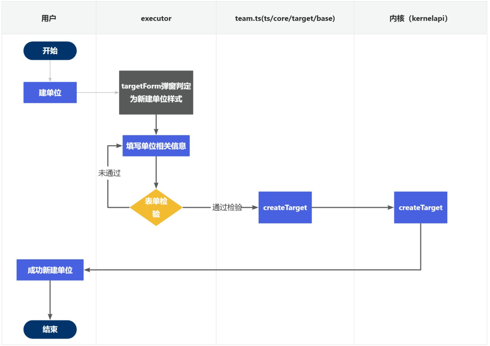

##### **5.1.2.2 添加单位**

用户进入平台首页后，点击常用栏下的“加单位”即可打开添加单位弹窗，输入单位社会统一信用代码进行搜索后就可以添加单位。发出申请后，可以在“办事——我的——我发起的”中查看该申请的详情信息，被添加单位的管理员则可以在“办事——对应单位——待办事项”中点击“操作——详情”进行申请的同意与拒绝。


##### **5.1.2.3. 邀请成员**

用户进入需要邀请成员的单位中，再进入该单位的“群组成员”分类下，右键“群组成员”后再点击“邀请成员”就可以通过搜索需要邀请的对象的代码发出邀请

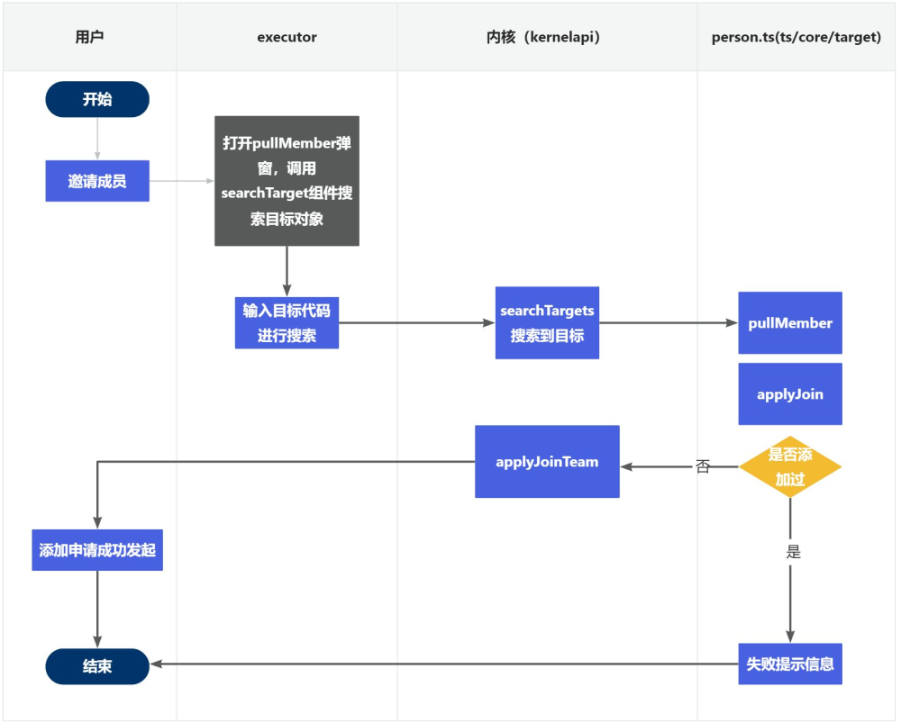

##### **5.1.2.4 单位权限、角色、岗位管理**

奥集能平台在用户创建单位后，会自动生成关系管理权、财务管理权、办事管理权三种权限以及拥有全部权限的管理员角色，创建单位的用户默认设置为管理员。管理员可以对单位所有内容进行管理操作。

进入单位成员页面后，右键“单位成员”即可进行权限、角色、岗位设置，首先需要进行的是权限设置，打开权限设置弹窗后点击右上角的“+”即可新增权限，用户也可以在点击某个权限后再新建权限，这样就可以创建子权限。

接下来是角色设置，打开角色设置弹窗后点击右上角的“+”即可新增角色，新增角色时需要选定该角色拥有的权限，注意一旦角色建立完成后拥有的权限不能再被更改。在角色设置弹窗中点击右上角的分配成员图标即可给成员设置角色权限。

岗位的设置类似于角色设置，但新建时不需要选择拥有的权限，而是在岗位建立好之后再选择该岗位对应的角色身份权限。具体操作为打开岗位设置弹窗，点击右上角“+”后新增一个岗位，岗位建立完成后再点击左侧菜单栏中的该岗位进入岗位详情页面，之后点击右上角的钥匙图标（添加角色），则可以设置该岗位拥有的角色权限，点击右上角的分配成员图标即可给岗位划分单位成员。

上述三设置中分配成员用到的均是pullMembers方法，前端页面见executor/config/settingModel，权限设置对应settingAuth，角色设置对应settingIdentity，岗位设置对应settingStation,调用的内核方法为createAuthority、createIdentity、createStation

##### **5.1.2.5 集群/部门设置**

进入设置模块后，右键想要新建集群/部门的单位，在右键菜单中选择设立更多即可新建集群/部门，新建后的集群/部门拥有和单位基本一样的操作。但是在集群/部门下只能再新建集群/部门，不能在部门之下新建集群，并且成员管理中只存在角色管理，权限和岗位继承自父单位。

集群/部门设置用到的内核方法为createTarget

##### **5.1.2.6 单位自定义设置**

（1）目录设置

考虑到一个单位中会存放许多的文件，为了便于用户进行管理增加了目录设置的功能，用户新建目录后可以在目录中存放文件，并且可以进行文件的复制、删除、剪贴操作。右键选中单位，在菜单栏中选择“新建更多——新建目录”即可完成新建目录操作。之后只需要再右键已有目录即可进行文件操作。


（2）应用设置

用户可以在单位中新建多个应用以帮助单位更好地进行工作。右键选中单位，在菜单栏中选择“新建更多——新建应用”即可完成新建应用操作。目前支持在应用中新建模块和新建办事，模块可以视为应用的一部分，拥有的操作同应用。办事则是描述性的流程图，用户可以自定义该图。

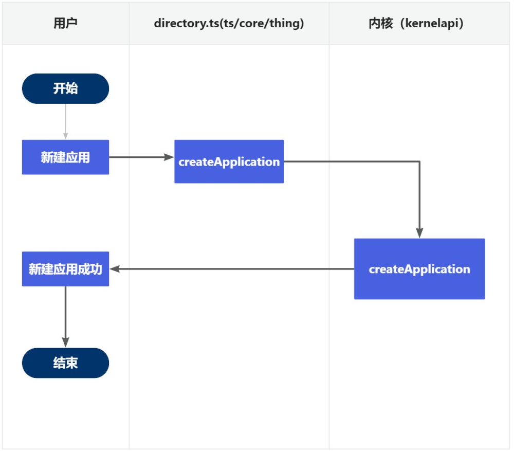

（3）分类设置

用户可以在单位中新建分类以帮助单位的管理。右键选中单位，在菜单栏中选择“新建更多——新建分类”即可完成新建分类操作。

（4）字典设置

为更加方便单位的自定义相关设置，用户可以在单位中新建字典。右键选中单位，在菜单栏中选择“新建更多——新建字典”即可完成新建分类操作。

（5）属性设置

为更加方便单位的自定义相关设置，用户可以在单位中新建属性。右键选中单位，在菜单栏中选择“新建更多——新建属性”即可完成新建分类操作。

（6）实体设置：同上

（7）事项设置：同上

（8）标准导入：同上

#### **5.1.3 沟通模块**

奥集能平台的聊天模块提供用户在群聊和单聊中进行自由沟通的功能。此外，也支持文件和聊天记录的储存以及查询。以下是详细的功能描述：

##### **5.1.3.1 群聊功能**

用户可以在群聊中与多名用户同时进行聊天，实现集体讨论与交流。群聊功能非常适合处理工作协调、团队讨论等多人参与的情况。

##### **5.1.3.2 单聊功能**

若用户希望与单位下的特定成员进行一对一的沟通，可以使用单聊功能。这个功能可以助用户进行更为私密或者针对性的交流

##### **5.1.3.3 文件传输**

文件传输在聊天过程中，用户可以发送各类文件给其他用户，该文件传输功能支持多种常见的文件格式，如文档、图片、音频、视频等，并且传输的所有文件可在共享文件中查看和下载。

##### **5.1.3.4 聊天记录储存功能**

所有的聊天记录都将储存在数据内核中，用户可以根据关键词查找并定位到对应的聊天记录。用户接受消息后，沟通模块会在消息列表中显示未读消息，其具体的时序图如下：

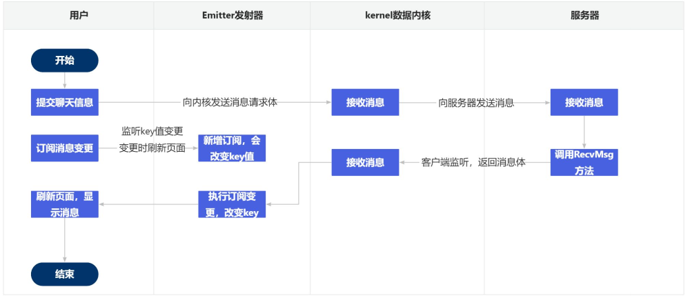

#### **5.1.4 存储模块**

奥集能平台的储存模块秉承Linux系统中一切皆文件的概念，将平台所有的对象都抽象成了文件，包括单位、群组、用户、办事等。用户可以在储存模块下上传文件，并且支持多种常见文件格式的打开，为用户提供了一种简洁而统一的资源管理方式。以下是详细的功能描述：

##### **5.1.4.1 文件化抽象**

储存模块将所有的对象都抽象为文件，这包括但不限于单位、群组、用户、办事等。这种文件化的抽象使得用户可以采用统一的方式处理和管理各种对象，大大简化了操作过程。

##### **5.1.4.2 文件上传**

用户可以在储存模块下上传文件，无论是文档、图片还是音频、视频等各种类型的文件上传后的文件将以文件的形式保存在储存模块中，方便用户在需要时进行查阅和使用。

##### **5.1.4.3 文件格式支持**

储存模块支持多种常见的文件格式，包括但不限于PDF、DOC、XLS、JPG、PNG、MP3、MP4等。用户上传的文件无需转换格式，直接上传后即可在平台上打开和查看。

##### **5.1.4.4 文件管理**

用户可以对上传的文件进行管理，包括查看文件详情、修改文件信息、删除文件等。同时，用户也可以对单位、群组、用户、办事等抽象成文件的对象进行类似的管理操作。

#### **5.1.5 办事模块**

##### **5.1.5.1 发起办事**

用户登录平台，在首页的应用板块或储存的应用中，点击应用展示该应用下的所有办事，打开对应的办事填写办事表单，点击"提交"按钮，完成办事发起。

##### **5.1.5.2 审核办事**

用户提交办事申请后，平台自动推送给审核员，审核员登录平台，在“待办事项”页面可以查看待审核的办事信息，审核员可以选择“通过”或“拒绝”，审核通过后，办事进入“已办事项”页面

##### **5.1.5.3 查看办事**

用户登录平台，进入办事模办事页面分为“待办事项”、“已办事项”、“我发起的”三个标签页用户可以查看各状态下的办事信息和详情点击单个办事可以查看详细信息，以及进行存证、打印等后续操作。

### **5.2 平台接口说明**

平台接口说明已整合至平台接口文档中，跳转链接：[接口文档](./接口文档.md)
