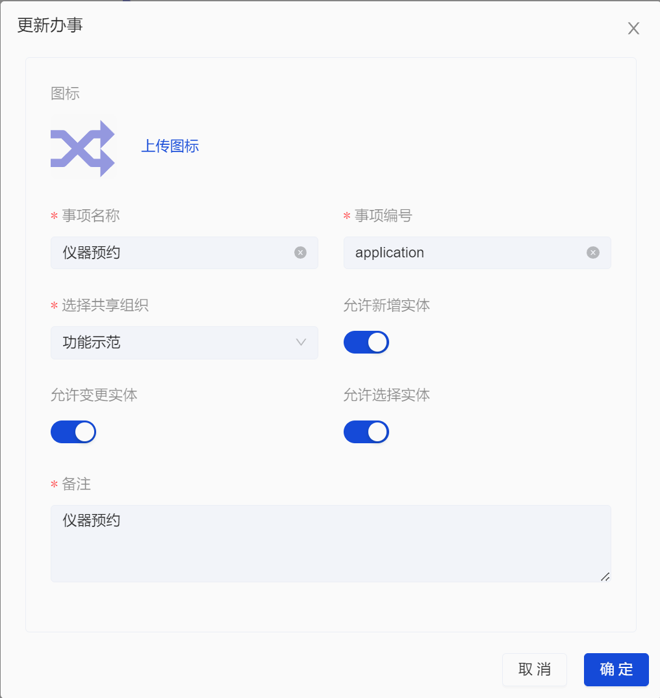
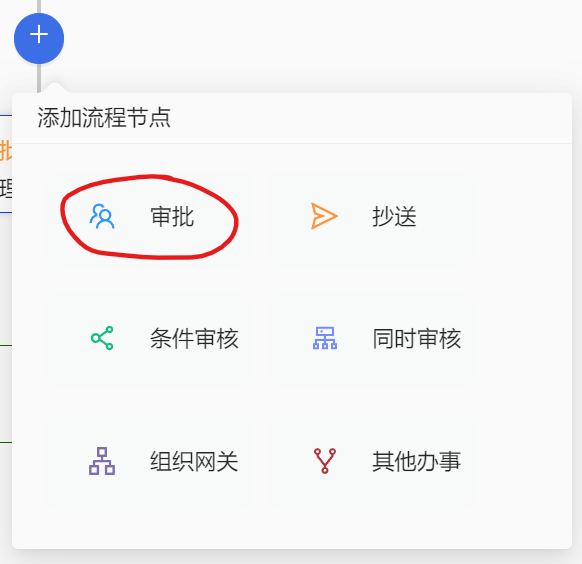
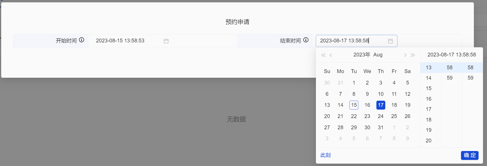
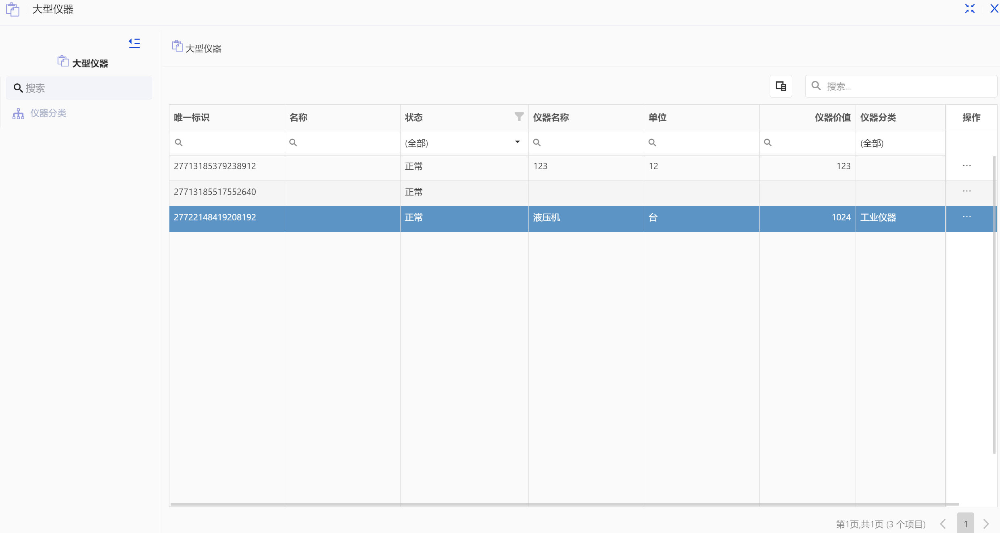

# **奥集能应用开发指南**

> 本教程将引导你逐步实现一个简单的大型仪器预约应用，实现新增大型仪器以及对仪器进行预约申请。在此过程中你会学习到基于 orginone 平台进行应用开发的基本过程，同时又助于让你对 orginone 平台有更深入的理解。

## **设置属性**

> 所谓 **属性** 是指表单中各个字段的标签，用于标识表单中每个字段的类型和名称。一个 **属性** 可以添加到多个表单中，为表单添加一项字段，而表单中的字段被称为 **特性**，若将 **属性** 比作父母，则 **特性** 就好比孩子。
> 在该应用中我们需要两个表单，分别是 **仪器列表** 和 **预约申请**，接下来我们为这两个表单创建属性。
> 为了方便创建应用，我们先在个人页面中创建一个单位，命名为 **功能示范**，在该单位下创建目录 **大型仪器共享**，在该目录下创建目录 **属性**，用来存放该应用下的所有属性。

> 右键目录空白处，依次点击 新建更多>新建属性。

> 在弹出的表单中填写我们的第一个属性：

> 创建好了仪器的名称属性后，我们再一一创建单位、分类、价值属性，单位和分类我们选择 **描述型**，价值我们选择 **数值型**。

> 设置好 **仪器列表** 的属性后，我们设置 **预约申请** 的属性。**预约申请** 的属性只需开始时间和结束时间，添加开始时间和结束时间即可，这两个属性的类型都设置为 **时间型**。

## **设置分类**

> 如果一些属性其值是固定的几个之一，我们可以建立 **分类**，来限定属性值，方便录入和统计，当然这一步不是必要的，不设立分类也可以实现本功能如果没有这方面的需求可以跳过。在要建立分类的属性的同级目录下，创建分类。

> 之后点击分类，录入分类项目：医疗仪器、工业仪器、办公设备。

> 设置好分类之后，回到目录右击仪器分类，点击更新信息。

> 将属性类型改为 分类型，在选择分类中选择刚刚创建好分类。

## **创建实体表单**

> **实体表单** 对应着的是实际存在的事物，而与之相对的 **事项表单** 是抽象的事物，例如在该应用中大型仪器应当使用实体表单，而预约申请则应当使用事项表单。
> 我们在 **大型仪器共享** 目录下再创建一个目录 **实体表单**，在该目录下右击空白处创建实体表单。

> 在表单的配置面板点击 **新增特性**，依次点击对应的目录，找到要新增的特性，这里我们选择：仪器名称、单位、仪器分类、仪器价值。

## **创建事项表单**

> 与实体表单类似，我们同样在先创建一个**事项目录**，在目录下新建**事项表单**，并将 开始时间以及结束时间作为表单特性。

## **创建办事**

> 办事只能存在于应用下，我们先在空白处右击，点击 **新建更多>新建应用**，命名为大型仪器共享

> 双击应用后进入应用，再右击空白处，新建办事。

> 将办事命名为 仪器预约，其余配置如下图所示：

> 双击办事，进入办事设计页面，在起始节点处关联子表，将 **预约申请** 以及 **大型仪器** 表单设置为子表：

> 在点击起始节点下方的加号，添加**审批节点**，在审批节点处添加审批对象管理员。

## **发起办事**

> 自此，一个简单的应用示例就完成了，接下来我们来发起办事。先切换到 **存储** 页面下，进入到应用，找到 **仪器预约** 办事。

> 再双击打开办事，点击 **大型仪器** 表单的 **新增** 按钮，并填写仪器数据。

> 填写完毕后，点击 预约申请 ，切换到 预约申请 子表，填写预约的开始时间和结束时间。

> 点击提交后，办事流程会进入 审批节点，在管理员审批过后，数据才会存档，这一办事流程才会结束。 管理员切换到办事页面，会在看到一项待审批的办事

> 可以在此处查看办事发起人提交的信息，审核无误后，点击通过。

> 之后在存储页面下，双击**大型仪器表单**，可以查看录入的仪器数据

> 预约申请事项表单只有两个字段，要想查看对应的仪器数据，应点击相应的记录查看归档痕迹，可以查看提交办事时一并提交的大型仪器子表。

## 通过导入标准快速配置

> 以上的教程中，从创建属性到创建表单的流程略显繁琐，在表单数量众多，属性复杂庞大的情况下会让工作量异常巨大，可以借助 **导入标准** 功能简化工作流程。
> 在 **设置** 页面下，左键单位右侧的三个点，或是右击目录的空白处，再依次点击 **新建更多>导入标准**。

> 点击 **导入模板**下载：

> 打开下载下来的模板 xlsx 文件，该模板文件有 8 张表，可以批量导入目录、字典、分类、属性和表单信息，下面我们拿属性定义为例

> 例如，我们录入之前创建的属性信息：

> 目录代码是新创建的属性所属的目录，目录代码可右击目录点击 **详细信息** 获得。
> 之后再右击目录空白处，依次点击 **新建更多>导入标准** 选择文件上传，上传之后确认录入的信息即可：

