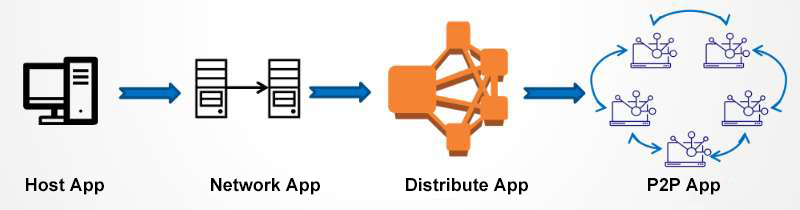
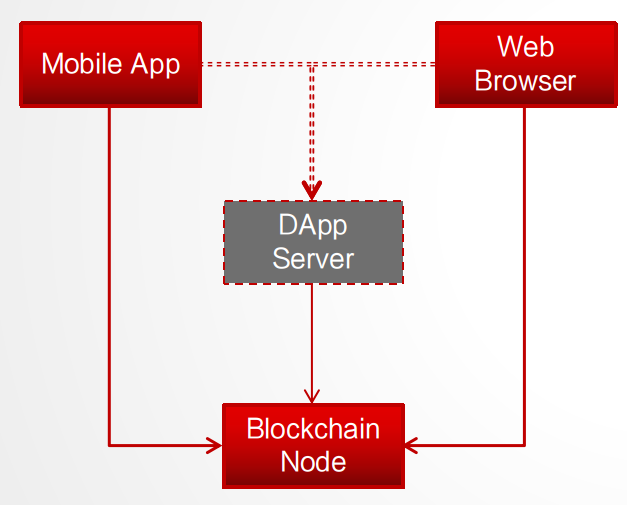
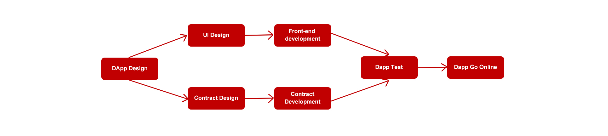

# DApp开发介绍

## 1 DApp的产生

App（Application）即应用，也就是我们常说的软件，在计算机诞生之后有限的几十年里，也经历了好几代演变，可以简单概括如下：

- **单机App:**

    组成App的所有元素均存放在一个独立的节点内，无需网络也可使用，这是App存在的最早形态，如DOS系统，单机小游戏等；

- **网络App:**

    可简单理解为经典的Client/Server模式，App由这两部分构成，可以存在1个以上不同的节点之上，缺一不可；如CS、红色警戒这些传统的网络游戏；

- **分布式App:**

    App的组成元素分散到N个节点，少数节点挂掉的情况下也不影响App的正常使用；如微信、淘宝等；

- **P2P App:**

    基于P2P网络的应用，App的组成或内容分散到N个节点，节点之间直接通信；目前常见的有BitTorrent下载、区块链应用等模式；

**各阶段App产生的背景及其优劣势对比分析：**

||优势|劣势|产生背景|
|--------|--------|--------|--------|
|单机App|使用简单 无需联网|使用受限，介质传播受限 信息隔离，无法共享|无互联网 网络受限 逻辑简单|
|网络App|门槛低，上手方便 借助网络，便于传播 信息共享，吸引用户|组网单一，可靠性低 存在单点瓶颈 扩容成本高|低速网络 数据量大 可靠性低|
|分布式App|传播快捷 数据全联通 扩容成本低 可靠性高|数据垄断 机制不透明 可信度严重依赖第三方|高速网络 海量数据 可靠性高 公司或行业垄断|
|P2P App|网络全联通 处理机制透明 数据公开、可信 自治理，不依赖第三方|发展早期，不成熟 处理性能低 处理数据量小|高速网络 海量数据 可靠性高 数据公开、可信|

**DApp的定义：**

DApp（Decentralized Application）又称“去中心化应用”，是相对传统中心化应用的另外一种叫法。其本质就是“智能合约”，只不过在其外层包装了一层接口，使之方便终端用户使用；传统App组成可以简单理解为：

> **App = Frontend + Server**

那么DApp则可以简单理解为：

> **DApp = Frontend + Contracts**

传统App的Server可以是单节点/分布式/云中的服务节点，它的特点是集中控制，由特定的一个或多个公司/组织/个人所有，属于集权模式，它的所有者可以控制应用的整个逻辑，所以被称为“中心化应用”；

而DApp中的Contracts(智能合约)则是部署在区块链网络中的程序逻辑，它运行在区块链网络中的所有节点内，各节点逻辑完全相同，而且节点所有者可以是任何人，一旦合约部署完成，它的行为不受任何特定的人控制，所以被称为“去中心化应用”。

## 2 DApp 设计及开发

一个典型的DApp组成如下：

- **前端：**

    用户端，可以是手机端App，也可以是网页，甚至可以是命令行，一般是直连区块链节点的RPC服务接口；

- **服务端（可选）：**

    类似中心化应用的服务节点，这里主要是封装DApp自己的服务接口，下层对接区块链，上层对接用户端，为了更好的用户体验，也可能会做一些数据状态缓存；

- **区块链端：**

    常规区块链节点，对前端或服务端提供区块链的操作接口服务，如发送交易、调用合约、查询结果等动作；

**而一个常规的DApp开发流程如下图所示：**

其实主要就是包含前端和合约两部分内容的开发，合约最终是部署在区块链网络上的，为DApp的主要执行逻辑，前端为用户交互界面；

即使不用前端，使用区块链的命令行接口依然可以调用合约，实现DApp的完整逻辑，但是用户门槛太高，所以，一般正式的DApp都会提供前端。

## 3 DApp的开发

链被设计为一个支持高度扩展的区块链开发平台，除了极少部分固有核心逻辑外，基本全部支持扩展定制；系统的扩展能力主要可以划分为两大类：

**一类是对系统能力的扩充定制：**

    链提供了底层的插件管理机制，基本上系统的所有能力都是作为一个插件存在，插件的实现本身可以被替换，开发者可以使用系统自身提供的系统插件，也可以自己开发新的功能插件，这些插件的能力覆盖到加解密、共识、存储、钱包、执行器、命令行等各方面内容。

**一类是扩展应用的开发：**

    链基于插件机制之上，针对DApp也单独提供了一套框架，以方便开发者进行DApp的开发，将开发者的关注重点聚焦到核心的合约逻辑（即执行器逻辑），并增加RPC接口和命令行接口的辅助（后面两者不是必需）。

链提供的DApp Framework中包含了三个元素：执行器、命令行和RPC，其中执行器就是DApp的合约逻辑；

命令行是提供命令行下的命令包装，这个一般可以不提供；

RPC是包装DApp特有的对外服务接口，一般情况下链框架提供的交易的创建、发送、查询等通用接口，如果有特殊需要，DApp也可以在这里开发自己专用的RPC接口。

