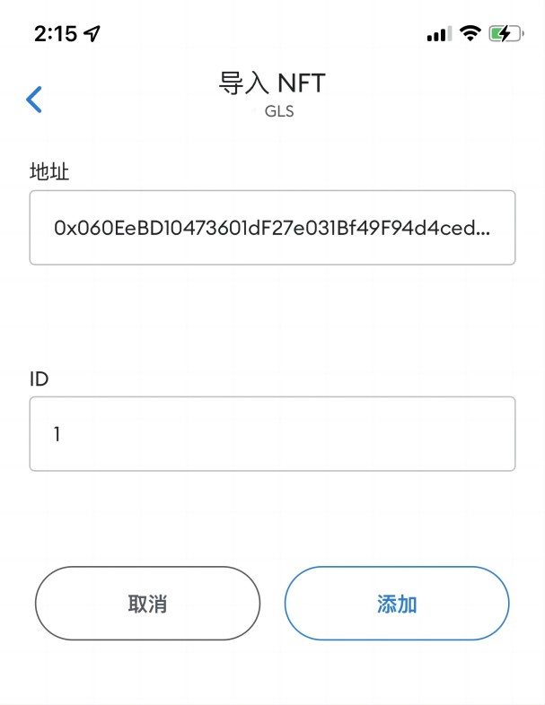

# 本文介绍在资产链上按标准发行NFT并在小狐狸钱包中显示NFT的属性值以及图片

## 1. 配置metaMask连接到资产链

1. Chrome或Firefox浏览器安装metamask插件（一定要从官网下载），创建助记词后添加资产链的连接


- 资产链网络名称： AssetChain
- 资产链RPC URL: http://124.71.110.109:8547 (以实际为准)
- 资产链ID: 898
- 货币符号：AS

## 2. 编译并发布合约到资产链

- **准备合约编译器**：打开在线remix IDE:  https://remix.ethereum.org/
- **新建工程文件**：在remix的workspace下，新建一个ERC721.sol空文件
- **编写一个ERC721合约**: 合约代码如下，并将代码黏贴到上述ERC721.sol文件中

```
 pragma solidity ^0.8.6;

   import "@openzeppelin/contracts/token/ERC721/ERC721.sol";
   import "@openzeppelin/contracts/utils/Counters.sol";
   import "@openzeppelin/contracts/access/Ownable.sol";
   import "@openzeppelin/contracts/token/ERC721/extensions/ERC721URIStorage.sol";

   contract MyNFT is ERC721URIStorage, Ownable {
       using Counters for Counters.Counter;
       Counters.Counter private _tokenIds;

       constructor() ERC721("Goddess", "GODDESS") {}

       function mintNFT(address recipient, string memory tokenURI)
           public onlyOwner
           returns (uint256)
       {
           _tokenIds.increment();

           uint256 newItemId = _tokenIds.current();
           _mint(recipient, newItemId);
           _setTokenURI(newItemId, tokenURI);

           return newItemId;
       }
   }
```


- **编译合约**：选用的编译器版本要大于等于合约中要求的版本


- **metamask连接remix**：环境选择[Injected Provider - MetaMask] --  弹出metamask插件，提示允不允许连接此网站 -- 选择连接， 连接成功后metemask中配置的chainID和用户账户地址都会在remix界面中显示。


- **部署合约到资产链上**：选择[deploy]按钮 -- 弹出matemask插件，提示部署合约所需的GAS费 (确保资产链上要拥有一定数量的燃料 )


左侧红框中Deployed Contracts:  部署好的合约地址

- status: 合约部署的结果
- transaction hash: 合约部署成功返回的hash值
- from: 部署人的地址
- gas: 部署合约需要的gas

## 3. 使用IPF存储NFT图片以及元数据

把图片和元数据存储到IPFS平台上，采用Pinata,如果没有注册，可以 [免费注册](https://app.pinata.cloud/) 一个。
创建好账户后：

- 导航到“文件”页面，然后单击页面左上角的蓝色“Upload”按钮。
- 将图像上传到 Pinata — 这将是您的 NFT 的图像资产。随意命名资产
- 上传后，在“File”页面的表格中看到文件信息。还将看到 CID 列。可以通过单击旁边的复制按钮来复制CID（例子里的CID值是：QmWgVLxwFbdcKX43DA71uBv7LdQjosEGstvUdU4EknRnjZ，在下文的json文件中会用到）。也可以通过“Name”列边上的预览查看上传的图片。
- 上传完图片后，接下来上传图片的描述信息（图片的属性，图片的存储路径等），内容如下所示：

```
{
  "attributes": [
    {
      "trait_type": "background",
      "value": "purple"
    }
  ],
  "description": "Goddess of twelve constellations",
  "image": "ipfs://QmWgVLxwFbdcKX43DA71uBv7LdQjosEGstvUdU4EknRnjZ",
  "name": "twelve constellations"
}
```

- 编辑好内容后，存成自定义.json文件，然后上传Pinata, 并获得json文件的路径：https://gateway.pinata.cloud/ipfs/QmZJPqNe2aukXrr2wErXaQhvRdiQcxWQpBW7xpMroLpXeg


## 4. 发行上述图片对应的NFT资产

- **调用合约**：点击[Deployed Contracts]边上下拉箭头，再点击[mint]函数边上的下拉箭头，输入mint函数所需的参数(注意数据类型要和solidity合约中定义的保持一致)


  调用函数：mintNFT
  参数recipient：区块链地址，指定NFT拥有者
  参数tokenURI: 上文获得的json文件路径
  点击[transact]后，再通过小狐狸签名，就完成了NFT的发行。
- **查询结果**：点击[Deployed Contracts]边上下拉箭头，再点击[balanceof]函数边上的下拉箭头，输入balanceof函数所需的参数,点击[call]按钮查询
- 


## 5. 在MetaMask钱包中导入上述NFT资产

- 打开MetaMask手机APP， 进入到[收藏品]标签页


 
- 点击[添加收藏品]
  填入NFT合约地址（在上述remix部署合约后可以获得）
  填入NFT ID值

  
  
- 点击[添加]按钮,再刷新页面，就可在钱包中看到NFT资产的属性值和图片


