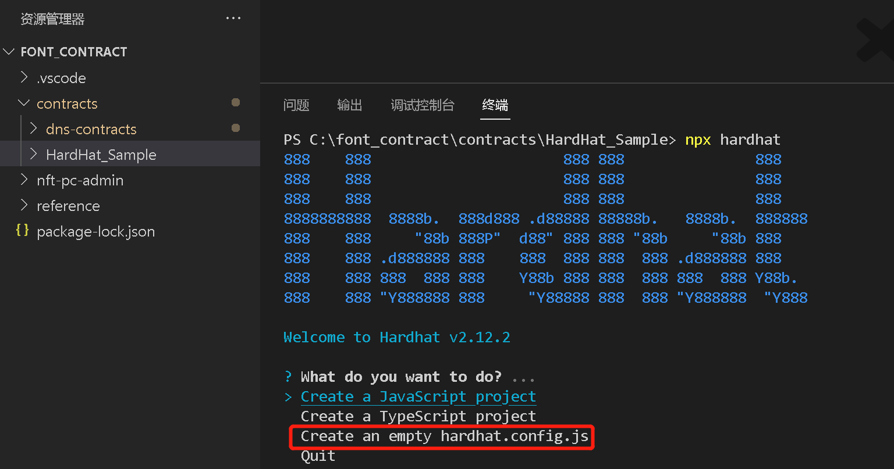
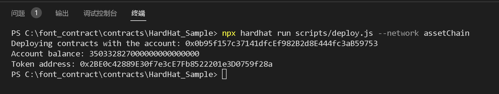

# 本文介绍在资产链上通过VSCode, HardHat和Node.js开发智能合约

下文以Window操作系统为例说明  
本文的测试代码在 HardHat_Sample 子目录下  

## 1. 搭建环境
1. 安装Node.js (version >= 16.0)  
2. 安装Yarn或npm  
3. 安装Visual Studio Code(VSCode), 安装完后再安装[Solidity]插件

## 2. 创建一个HardHat项目
1. 新建一个文件夹：HardHat_Sample
2. 通过VSCode打开这个文件夹，并在VSCode的终端下，进入此文件夹  
```
cd HardHat_Sample
```  
3. 初始化一个npm项目  
```
npm init
```  
4. 安装HardHat
```
npm install --save-dev hardhat
```  
5. 在安装 Hardhat 的同一目录中运行
```
npx hardhat
```  
用键盘选择Create an empty hardhat.config.js并按回车键



6. 安装harthat-toolbox插件
```  
npm install --save-dev @nomicfoundation/hardhat-toolbox
```  
7. 将在hardhat.config.js头部加入以下语句
```  
require("@nomicfoundation/hardhat-toolbox");
```  

## 3. 编译并部署合约到资产链 
1. 在HardHat_Sample目录下新建一个contracts的子目录（固定的目录名），再创建一个Token.sol文件,并编写一个合约如下：
```  
//SPDX-License-Identifier: UNLICENSED

// Solidity files have to start with this pragma.
// It will be used by the Solidity compiler to validate its version.
pragma solidity ^0.8.9;


contract Token {
    string public name = "My Hardhat Token";
    string public symbol = "MHT";

    uint256 public totalSupply = 1000000;

    address public owner;

    mapping(address => uint256) balances;

    event Transfer(address indexed _from, address indexed _to, uint256 _value);

    /**
     * Contract initialization.
     */
    constructor() {
        // The totalSupply is assigned to the transaction sender, which is the
        // account that is deploying the contract.
        balances[msg.sender] = totalSupply;
        owner = msg.sender;
    }

    /**
     * A function to transfer tokens.
     *
     * The `external` modifier makes a function *only* callable from *outside*
     * the contract.
     */
    function transfer(address to, uint256 amount) external {
        // Check if the transaction sender has enough tokens.
        // If `require`'s first argument evaluates to `false` then the
        // transaction will revert.
        require(balances[msg.sender] >= amount, "Not enough tokens");

        // Transfer the amount.
        balances[msg.sender] -= amount;
        balances[to] += amount;

        // Notify off-chain applications of the transfer.
        emit Transfer(msg.sender, to, amount);
    }

    /**
     * Read only function to retrieve the token balance of a given account.
     *
     * The `view` modifier indicates that it doesn't modify the contract's
     * state, which allows us to call it without executing a transaction.
     */
    function balanceOf(address account) external view returns (uint256) {
        return balances[account];
    }
}
```  

2. 执行以下命令编译合约  
```  
npx hardhat compile 
```  

3. 编写部署脚本
新建一个scripts目录，再下面新建一个deploy.js文件， 并黏贴以下内容
```  
async function main() {
  const [deployer] = await ethers.getSigners();

  console.log("Deploying contracts with the account:", deployer.address);

  console.log("Account balance:", (await deployer.getBalance()).toString());

  const Token = await ethers.getContractFactory("Token");
  const token = await Token.deploy();

  console.log("Token address:", token.address);
}

main()
  .then(() => process.exit(0))
  .catch((error) => {
    console.error(error);
    process.exit(1);
  });
```  

4. 编写网络连接脚本  
编辑hardhat.config.js,添加资产链的服务端口以及部署合约用到的私钥信息，确保私钥对应的地址下有资产通证，否则合约部署不会成功  
备注：私钥是用户隐私信息，代码上传github时建议隐去这个信息  
```  
require("@nomicfoundation/hardhat-toolbox");

/** @type import('hardhat/config').HardhatUserConfig */
module.exports = {
  solidity: "0.8.17",
  networks: {
    assetChain: {
      url: `http://124.71.110.109:8547`,
      accounts: ["用户的私钥，里面需要有资产通证"]
    }
  }
};
```  

5 运行合约部署, 如果一切顺利,可以看到下面截图中的合约地址
```
npx hardhat run scripts/deploy.js --network assetChain
```

