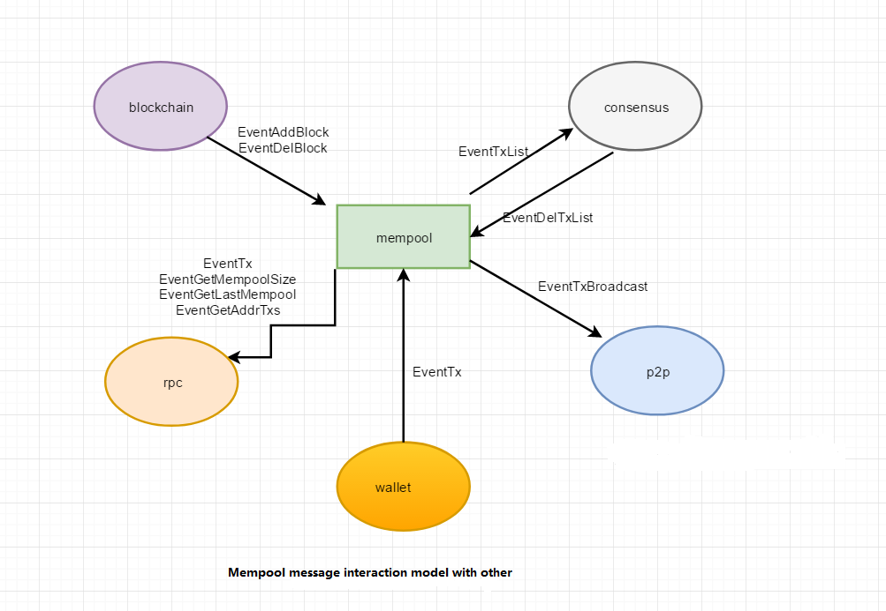

##  1. 模块介绍

> mempool中文名就是交易池，顾名思义，就是做交易的一个缓存功能。

主要目的是为了解决共识模块可能比rpc模块速度慢的问题。
在mempool中会对接收的交易做初步合法性的校验，过滤掉一些非法的交易。
对交易发送者做流量限制，防止同一地址发送太过频繁。同时,mempool会与其他模块会有消息交互，后面会一一介绍。

Github文件位置：chain33/system/mempool/

##  2. 逻辑架构及上下文

> 下图就是各模块与mempool的消息交互图



> mempool与 blockchain的交互:

 1. 当有新的区块成写入后，blockchain 会给mempool发送types.EventAddBlock消息事件，告诉mempool，已经有block成功写入了，mempool收到后，会触发            mem.RemoveTxsOfBlock(block)方法，移除Mempool中已被Blockchain打包的tx。
 2. 当有区块回退时，blockchain会给mempool 发送一条types.EventDelBlock 消息类型的消息,告诉mempool,有区块需要回退,会触发mem.setHeader()和mem.DelBlock()方法,把相应区块内的交易重新加回Mempool中.

> mempool与 consensus的交互:

1. 区块打包时，consensus会主动发送一个types.EventTxList 消息，去触发mem.GetTxList()方法，获取需要打包的交易列表。
2. 区块打包时，当consensus给blockchain，发送types.EventAddBlockDetail消息事件，有新的区块需要写入，如果新块写成功了，blockchain会给consensus返回相应的          blockdetail信息，根据这个和原始block找出错误交易列表,然后往mempool 发送types.EventDelTxList消息，去删除相应的错误交易。

> mempool与 p2p的交互:

 1. 如果mempool收到rpc 发送过来的tx,会经过一系列校验检查,如果校验过了,就会把合法tx 通过p2p 模块广播出去

> mempool与 rpc的交互:

 1. mempool中给rpc提供了 GetLastMempool(),GetMempool(),SendTx() 3个接口，供外部调用

## 3. mempool交易校验

> mempool中的交易校验很严格，主要检查的地方有

 1. 检查交易是否为空，手续费是否满足系统设置的最小手续费要求
 2. 检查交易是单笔交易，还是交易组
 3. 检查接收地址是否合法
 4. 检查交易是否为重复交易
 5. 检查交易账户在Mempool中是否存在过多交易
 6. 检查交易是否过期

具体可参考mempool模块的代码,<a href="https://github.com/33cn/chain33/blob/master/mempool/check.go" target="_blank">点这里</a>

## 4. mempool存储的数据结构

mempool 中主要定义了三种数据结构，txCache, Item, mempool
下面是这三种数据结构

```go
// Module txCache
type txCache struct {
	size       int                             //缓存大小，默认10240
	txMap      map[string]*list.Element        //Key=string(txhash), Value= Item
	txList     *list.List                      //链表
	txFrontTen []*types.Transaction            //记录最新的10笔交易
	accMap     map[string][]*types.Transaction //记录相应账户地址在mempool已经有多少笔交易了，同一个地址（tx.from)最多只有100笔
}
```

```go
// Item为Mempool中包装交易的数据结构
type Item struct {
	value     *types.Transaction
	priority  int64       //优先级，这里是根据手续费划分等级
	enterTime int64       //进入时间戳
}
```

```go
// mempool数据结构
type Mempool struct {
	proxyMtx          sync.Mutex           //互斥锁，用于支持后面mempool中的多个协程之间的并发操作 
	cache             *txCache             //缓存，默认10240
	in                chan queue.Message   //对收到的msg进行的串行化处理,和out配合一起使用，主要处理EventTx消息
	out               <-chan queue.Message //同上
	client            queue.Client         //queue客户端，用于内部各个模块之间的通信
	header            *types.Header        //存放最新的区块头信息 
	minFee            int64                //最小手续费
	addedTxs          *lru.Cache           //存放已经打包的tx hash信息
	sync              bool                 //判断blockchain是否同步,当区块没有同步的话，是没法成功往mempool发送新的交易的
	cfg               *types.MemPool       //mempool的配置
	poolHeader        chan struct{}        //暂时未用到，预留参数
	isclose           int32                //1表示关闭
	wg                sync.WaitGroup       //用来实现协程同步
	done              chan struct{}        //mempool是否完成也就是结束的一种信号
	removeBlockTicket *time.Ticker         //定时清理已打包的tx 的定时器，默认一分钟
}
```
## 5. mempool消息处理逻辑

 1. 各个模块都是通过Queue.client,互相发送Message来通信的
 2. mempool中对其他模块发送过来的消息处理在SetQueueClient()方法中，下面通过伪代码来分析mempool如何处理接收的消息。

```go
func (mem *Mempool) SetQueueClient(client queue.Client) {
	mem.client = client
	mem.client.Sub("mempool")
	mem.wg.Add(1)
	go mem.pollLastHeader()
	mem.wg.Add(1)
	go mem.getSync()
	//	go mem.ReTrySend()
	// 从badChan读取坏消息，并回复错误信息
	mem.out = mem.pipeLine()
	mlog.Info("mempool piple line start")
	mem.wg.Add(1)
	go func() {
		defer mlog.Info("piple line quit")
		defer mem.wg.Done()
		for m := range mem.out {
        ......
	}()
	mem.wg.Add(1)
	//定时移除已经打包过的tx
	go mem.RemoveBlockedTxs()
	mem.wg.Add(1)
	go func() {
		defer mlog.Info("mempool message recv quit")
		defer mem.wg.Done()
		for msg := range mem.client.Recv() {
			mlog.Debug("mempool recv", "msgid", msg.Id, "msg", types.GetEventName(int(msg.Ty)))
			beg := types.Now()
			switch msg.Ty {
			case types.EventTx:
			// EventTx 消息类型，会由 rpc,p2p,wallet 模块发送这样类型的消息，同时附带一笔tx
			......
			
			......
			default:
			}
			mlog.Debug("mempool", "cost", types.Since(beg), "msg", types.GetEventName(int(msg.Ty)))
		}
	}()
}
```
通过代码我们可以看到这里主要起个几个协程，分别去执行pollLastHeader(获取最新的区块头信息),getSync(获取mempool同步状态)，pipeLine(串行化任务)，另一个则是去处理client接收到的msg

## 6. mempool提供的接口

 mempool 中 提供了 GetLastMempool(),GetMempool(),SendTx(),GetTxList()四个接口，供其他模块调用

```go
/**
* 获取mempool中最新的10笔交易
* @param： 无
* @return：*types.ReplyTxList
*/
// types.EventGetLastMempool
GetLastMempool() (*types.ReplyTxList, error)
```

```go
/**
* 获取mempool中的所有tx
* @param： 无
* @return：*types.ReplyTxList
*/
// types.EventGetMempool
GetMempool() (*types.ReplyTxList, error)
```

```go
/**
* 往mempool中发送交易
* @param： param *types.Transaction 签完名后的tx
* @return：*types.Reply
*/
// 同步发送交易信息到指定模块，获取应答消息 types.EventTx
SendTx(param *types.Transaction) (*types.Reply, error)
```

```go
/**
*  根据传入的txHash过滤获取mempool中的tx
* @param： param *types.TxHashList txhash
* @return：*types.ReplyTxList
*/
// types.EventTxList
GetTxList(param *types.TxHashList) (*types.ReplyTxList, error)
```
