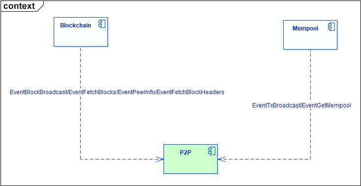

## 1 模块介绍

P2P 模块是处理节点相互通信的组件，包括节点发现并建立连接，广播区块和交易，同步区块。

## 2 逻辑架构及上下文

### 2.1 P2P 上下文

- 与 Mempool 模块的交互：广播 Mempool 模块发送过来的交易，获取 Mempool 模块中的交易
- 与 Blockchain 模块的交互：广播 Blockchain 模块发送过来的区块，处理获取 peer 信息的请求，处理从对端下载区块和区块头的请求

### 2.2 P2P 逻辑结构

P2P 模块包含如下功能模块

> 节点发现模块

发现网络中的节点，并尝试建立连接

> 数据下载模块

请求对端节点下载区块，用于同步区块

> 数据过滤模块

过滤重复接收到的广播交易和区块

> 节点监控模块

动态监测已建立连接的对端节点

## 3 处理逻辑

> 下面介绍以上模块的处理逻辑

### 3.1 节点发现模块

P2P 模块启动后，首先从本地数据库读取上次保存的远程节点信息到缓存中。如果本地数据库信息为空，则开始加载种子节点到缓存，并尝试连接这些节点。

连接完这些节点后，如果不满足最大连接数，开始向这些节点发起 GetAddrList 请求。对端节点收到请求后，会把当前连接的节点信息，以及对方的高度信息一并返回给请求方，请求的节点可以根据自身节点的区块高度，选择要连接的节点，比如选择比自身区块高的节点。

具体处理过程可以参考 getAddrFromAddrBook，getAddrFromOnline 等函数

### 3.2 数据下载模块

同步区块时 Blockchain 模块向 P2P 模块发送 EventFetchBlocks 消息，随后 P2P 模块向已建立连接的节点发起下载区块的请求。

下载数据有两种模式：第一种是对指定节点进行下载；第二种是对所有连接的节点进行均衡下载，此时服务能力强的节点会收到更多的下载请求。

具体处理过程可以参考 GetBlocks，DownloadBlock 等函数

### 3.3 数据过滤模块

节点会收到网络中其他节点广播的交易和区块，多次接收会出现重复数据，因此需要进行过滤。这里 P2P 模块采用 LRU 数据结构对交易和区块进行缓存，并在 P2P 模块中客户端和服务端的接口函数进行过滤。

未过滤掉的交易发送到 Mempool 模块进行缓存并向其他节点广播，区块发送到 Blockchain 模块进行打包并向其他节点广播。

具体处理过程可以参考 ServerStreamRead， readStream，RegRecvData 等函数

### 3.4 节点监控模块

现实中网络环境复杂多变，会出现节点由于机器故障或者网络环境影响等原因，脱离了 P2P 网络，此时需要 P2P 模块能快速发现异常节点，从而剔除该节点，并选择新的节点来补充。

P2P 模块也启动定时任务去实时调整连接节点的列表，包括删除连接数过多和过低的节点，区块高度过低的节点，种子节点等。

具体处理过程可以参考 monitorErrPeer，monitorPeers， nodeReBalance 等函数
