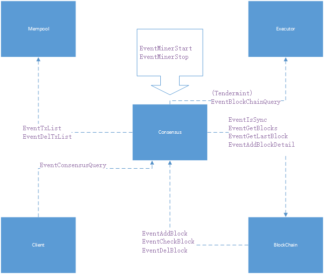
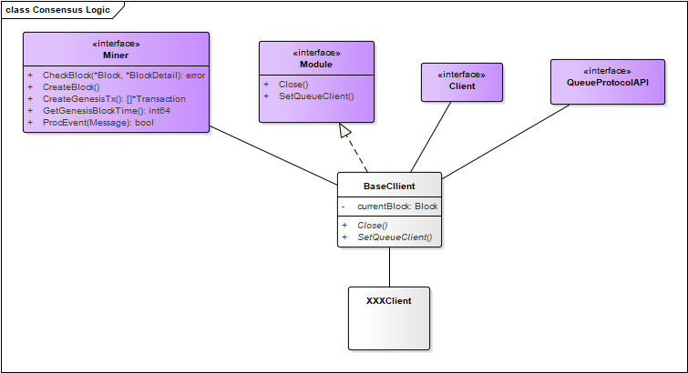

## 1.模块介绍

共识模块是实现区块链共识机制的模块，共识机制是区块链技术的重要组件。区块链共识机制的目标是使所有的诚实节点保存一致的区块链视图，同时满足两个性质：
- **一致性**：所有诚实节点保存的区块链的前缀部分完全相同。
- **有效性**：由某诚实节点发布的信息终将被其他所有诚实节点记录在自己的区块链中。

通俗来说，共识机制在区块链网络内起到决定谁负责生成新区块以及维护区块链统一的作用。

目前区块链的共识机制大致可以分为PoW（Proof of Work 工作量证明）、PoS（Proof of Stack 权益证明）、DPoS（Delegated Proof of Stake 委托权益证明）以及分布式一致性算法几类。

## 2.逻辑架构及上下文

> 共识模块上下文

目前系统中的共识模块是可插拔的，支持平行链共识，PBFT，Raft，Tendermint，Ticket几种共识算法。

共识模块在整个系统中所处的地位如下图：



共识模块是连接交易与区块的桥梁，作用主要体现在推动区块的产生。所有由共识模块发出的事件都是实现这一目标。

*注：EventBlockChainQuery事件除外，在该模块中此事件只与Tendermint共识的动态增加，删除Validator节点功能有关。*

- 为实现这一目标分成如下几步：

1. 同步区块高度：通过向Blockchain模块发送EventIsSync事件，得到当前区块高度是否已经与主链高度一致，如果一致，则可以参与新高度区块的共识过程；否则，继续等待同步到最新高度。
2. 获取交易：通过向Mempool模块发送EventTxList事件触发，获取需要打包进区块的交易。
3. 交易共识：对这些将要打包的交易进行验证，并确定哪个节点负责生成新区块。
4. 产生新区块：通过向Blockchain模块发送EventAddBlockDetail事件触发。
5. 删除错误交易：通过向Mempool模块发送EventDelTxList事件触发。

*注：EventGetBlocks用于向Blockchain模块获取指定高度范围的区块，EventGetLastBlock事件用于向Blockchain模块获取最新的区块。*

> 共识模块内部逻辑



如上图所示，共识模块主要通过Miner和Module两个接口实现主要逻辑功能。

## 3.处理逻辑

> 下面分别介绍这两个接口的具体功能。

### 3.1 模块接口
#### 接口定义

```go
/// Module be used for module interface
type Module interface {
	//加载共识模块
	SetQueueClient(client Client)
	//关闭共识模块，完成清理工作
	Close()
}
```

> 其中SetQueueClient接口的参数Client是实现了消息队列client接口。实现的主要功能如下：
> 1. 设置消息队列Client
> 2. 初始化本地区块
> 3. 订阅消息并开始消息循环
> 4. 开启共识过程

### 3.2 Minner接口
#### 接口定义

```go
type Miner interface {
	//创建创世区块中包含的交易
	CreateGenesisTx() []*types.Transaction
	//获取创世区块时间
	GetGenesisBlockTime() int64
	//获取交易，打包生成新区块
	CreateBlock()
	//通过比较父区块和当前区块，检查当前区块的有效性
	CheckBlock(parent *types.Block, current *types.BlockDetail) error
	//处理自定义事件:处理除BaseClient处理的事件以外的自定义事件
	//*注：如果不需要处理自定义事件直接返回false，对关心的事件处理成功后返回true。*
	ProcEvent(msg queue.Message) bool
}
```

## 4. 二次开发

为介绍共识模块的二次开发过程。假定有一个节点数不变的区块链网络采用如下共识规则：

 1. 每个节点的配置项中包含NodeId配置，用于配置节点唯一编号，从0开始递增，每次加1。
 2. 每个节点的配置项中包含NodeCount配置，用于配置该网络包含的总节点数，所有节点该值必须一致。
 3. 区块高度与节点数取模后的值与哪个节点编号一致，该节点将作为生成新区块的节点。

> 将该共识规则命名为NumberDecide。

### 4.1 整体介绍

共识模块的二次开发的目录主要集中在plugin/consensus目录下。在该目录下创建numberdecide文件夹，在该文件夹下创建numberdecide.go和numberdecide_test.go文件。

### 4.2 结构定义

```go
type subConfig struct {
	//创世地址
	Genesis                   string  `json:"genesis"`
	//创世区块时间
	GenesisBlockTime          int64   `json:"genesisBlockTime"`
	//节点编号
	NodeId                    int64   `json:"nodeId"`
	//节点信息（IP，端口号）
	Nodes                     []string   `json:"nodes"`
}
```

> 定义共识模块子配置结构体，用于从配置文件中获取配置信息。创世地址和创始区块时间会在Miner接口的CreateGenesisTx()和GetGenesisBlockTime()中用到，可以使用consensus配置项中的配置，也可以在子配置中添加配置使用，推荐在子配置中添加。

```go
type Client struct {
	//父类对象指针
	*drivers.BaseClient
	//子配置
	subcfg    *subConfig
}
```

> 定义实现Module接口的Client结构体。

### 4.3 配置

 1. 修改配置文件assetchain.toml，修改[consensus]项中的name键为"numberdecide"。
 2. 新增[consensus.sub.numberdecide]配置项，增加genesis，genesisBlockTime，nodeId，nodes项。
 3. 在numberdecide.go中增加init()函数，并在init文件夹下的init.go中增加numberdecide目录。

> [consensus]  
> name="numberdecide"  
> genesisBlockTime=1514533394  
> genesis="14KEKbYtKKQm4wMthSK9J4La4nAiidGozt"  
>
> [consensus.sub.numberdecide]  
> genesis="14KEKbYtKKQm4wMthSK9J4La4nAiidGozt"  
> genesisBlockTime=1514534444  
> nodeId=0  
> nodes=["10.0.0.2:20181","10.0.0.3:20180","10.0.0.4:20180","10.0.0.5:20180"]  

numberdecide.go

```go
func init() {
	drivers.Reg("numberdecide", New)
	drivers.QueryData.Register("numberdecide", &Client{})
}

func New(cfg *types.Consensus, sub []byte) queue.Module {
	c := drivers.NewBaseClient(cfg)
	var subcfg subConfig
	if sub != nil {
		types.MustDecode(sub, &subcfg)
	}

	client := &Client{c, &subcfg}
	c.SetChild(client)
	return client
}
```

init.go

```go
import (
	_ "github.com/33cn/plugin/plugin/consensus/para"
	_ "github.com/33cn/plugin/plugin/consensus/pbft"
	_ "github.com/33cn/plugin/plugin/consensus/raft"
	_ "github.com/33cn/plugin/plugin/consensus/tendermint"
	_ "github.com/33cn/plugin/plugin/consensus/ticket"
	//新增numberdecide目录
	_ "github.com/33cn/plugin/plugin/consensus/numberdecide"
)
```

### 4.4 实现Module接口

```go
func (bc *Client) SetQueueClient(c queue.Client) {
	bc.InitClient(c, func() {
		//call init block
		bc.InitBlock()
	})
	go bc.EventLoop()
	//启动共识
	go bc.startConsensus()
}

func (client *Client) Close() {
	//关闭监听服务，清除相关存储
	slog.Info("consensus numberdecide closed")
}

func (client *Client) startConsensus() {
	client.connectNodes()
	client.CreateBlock()
}

func (client *Client) connectNodes() {
	//创建tcp服务监听其他节点连接
	go client.listenRoutine()
	for {
		//连接配置文件中的节点
		for i:=0; i<len(client.subcfg.Nodes); i++ {
			//如果node ip已连接，则跳过
			//if ... {
			//    continue
			//} else {
			// 主动连接该节点
			//}
		}
		//如果所有节点都已连接，则返回
		//if ... {
		//    return
		//}
		time.Sleep(time.Second)

	}
}

func (client *Client) listenRoutine() {
	//开始监听并处理连接，进而获取nodeid及node
}
```

### 4.5 实现Miner接口

由于本例的共识机制与solo有相似之处，所以Miner接口中GetGenesisBlockTime()，CreateGenesisTx()，ProcEvent()，CheckBlock()的实现与solo是一样的在此不做赘述，仅就CreateBlock()稍作修改。

```go
func (client *Client) CreateBlock() {
	issleep := true
	for {
		if !client.IsMining() || !client.IsCaughtUp() {
			time.Sleep(time.Second)
			continue
		}
		if issleep {
			time.Sleep(time.Second)
		}
		...
		//判断高度与节点个数的mod值是否与本节点的id相等，相等则打包否则不打包等待广播高度更新
		if (lastBlock.Height + 1) % int64(len(client.subcfg.Nodes)) == client.subcfg.NodeId {
			err := client.WriteBlock(lastBlock.StateHash, &newblock)
			//判断有没有交易是被删除的，这类交易要从mempool 中删除
			if err != nil {
				issleep = true
				continue
			}
		} else {
			//检查高度是否已经更新
			//client.checkHeightUpdate()
		}
	}
}
```
